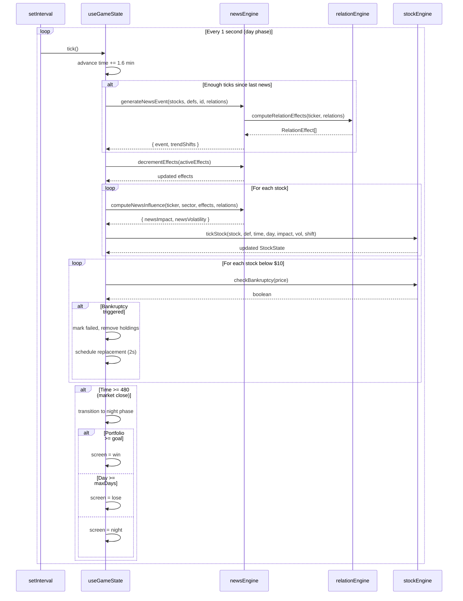
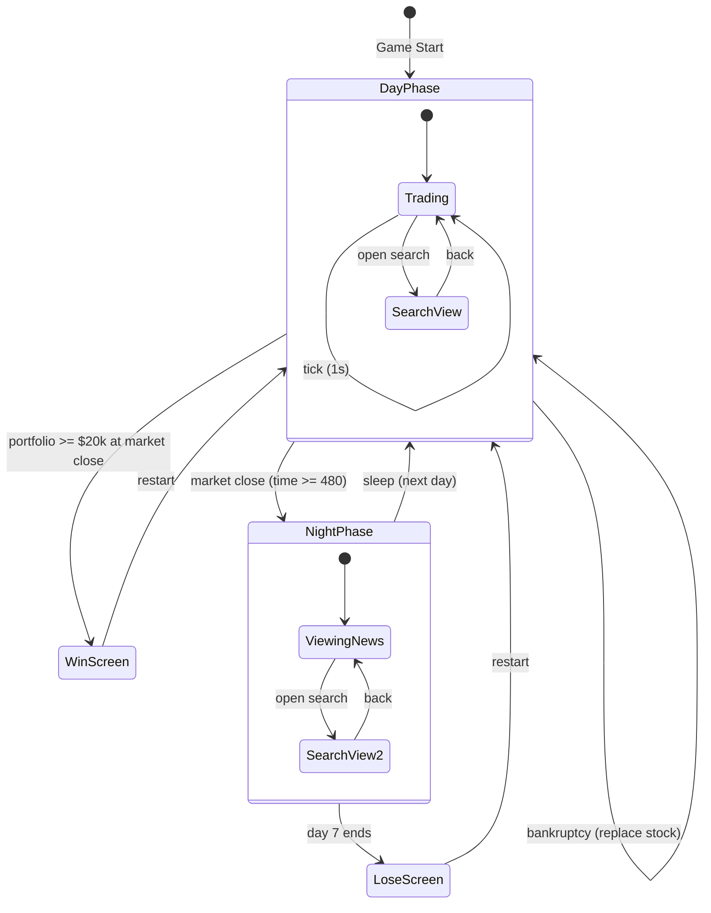

# UML Class Diagram

```mermaid
classDiagram
    direction TB

    class StockDefinition {
        +string ticker
        +string name
        +string sector
        +number basePrice
        +number volatility
    }

    class PricePoint {
        +number time
        +number price
    }

    class StockState {
        +string ticker
        +number currentPrice
        +number openPrice
        +number dayTrend
        +PricePoint[] history
        +boolean failed
    }

    class Holdings {
        +number [ticker]
    }

    class NewsArticle {
        +string headline
        +string blurb
        +string[] tags
    }

    class LiveNewsEvent {
        +number id
        +string headline
        +number impact
        +number volatility
        +number duration
        +NewsEventType type
        +string targetSector
        +string targetTicker
    }

    class StockRelation {
        +string from
        +string to
        +RelationType type
        +string description
    }

    class GameState {
        +number day
        +number maxDays
        +number timeMinutes
        +Phase phase
        +Screen screen
        +number cash
        +Holdings holdings
        +StockState[] stocks
        +StockDefinition[] stockDefinitions
        +string selectedTicker
        +number goal
        +number dayStartPortfolio
        +NewsArticle[] news
        +LiveNewsEvent[] liveNews
        +LiveNewsEvent[] activeEffects
        +string bankruptcyAlert
        +StockRelation[] relations
    }

    class useGameState {
        -GameState state
        -Ref~Interval~ tickRef
        -Ref~number~ newsIdCounterRef
        -Ref~Map~ trendShiftsRef
        -Ref~number~ ticksSinceNewsRef
        -Ref~number~ nextNewsAtRef
        -Ref~Timeout~ bankruptcyTimerRef
        +number portfolioValue
        +number todayPL
        +selectStock(ticker) void
        +buy(ticker, qty) void
        +sell(ticker, qty) void
        +goToSearch() void
        +goBackFromSearch() void
        +sleep() void
        +restart() void
        -tick() void
        -replaceFailedStock() void
    }

    class stockEngine {
        +MARKET_OPEN: 0
        +MARKET_CLOSE: 480
        +REAL_DAY_SECONDS: 300
        +TICK_INTERVAL_MS: 1000
        +MINUTES_PER_TICK: 1.6
        +BANKRUPTCY_THRESHOLD: 10
        +toAbsoluteTime(day, minutes) number
        +formatGameTime(absTime) string
        +formatGameTimeWithDay(absTime) string
        +generateDayTrend(volatility) number
        +generatePrefillHistory(def) PricePoint[]
        +initStockState(def, day, prevClose, prevHistory) StockState
        +tickStock(stock, def, time, day, newsImpact, newsVol, trendShift) StockState
        +checkBankruptcy(price) boolean
        +generateReplacementStock(sector, day, existing) ReplacementResult
        +resetReplacementNames() void
    }

    class newsEngine {
        +MAX_LIVE_NEWS: 8
        +generateNewsEvent(stocks, defs, id, relations) NewsResult
        +computeNewsInfluence(ticker, sector, effects, relations) NewsInfluence
        +decrementEffects(effects) LiveNewsEvent[]
    }

    class relationEngine {
        +generateInitialRelations(defs) StockRelation[]
        +generateRelationsForReplacement(ticker, sector, name, defs, existing) StockRelation[]
        +removeRelationsForTicker(relations, ticker) StockRelation[]
        +computeRelationEffects(targetTicker, relations) RelationEffect[]
    }

    class stockData {
        +STOCKS: StockDefinition[]
    }

    class newsData {
        +getNewsForDay(day) NewsArticle[]
    }

    class relationData {
        +RELATION_DESCRIPTIONS: Record~RelationType, string[]~
    }

    class App {
        +render() JSX
    }

    class DayUI {
        +state: GameState
        +portfolioValue: number
        +todayPL: number
        -tradeQty: number
        +onSelectStock(ticker) void
        +onBuy(ticker, qty) void
        +onSell(ticker, qty) void
        +onSearch() void
    }

    class NightUI {
        +state: GameState
        +portfolioValue: number
        +onSleep() void
    }

    class SearchUI {
        +state: GameState
        +portfolioValue: number
        +todayPL: number
        +onBack() void
        +onBuy(ticker, qty) void
        +onSelectStock(ticker) void
    }

    class StockList {
        +stocks: StockState[]
        +stockDefinitions: StockDefinition[]
        +selectedTicker: string
        +holdings: Holdings
        +relations: StockRelation[]
        +onSelect(ticker) void
    }

    class StockChart {
        +history: PricePoint[]
        +ticker: string
        +currentPrice: number
        +currentTime: number
        +day: number
        -windowKey: WindowKey
    }

    class InfoPanel {
        +goal: number
        +portfolioValue: number
        +todayPL: number
        +cash: number
    }

    class NewsFeed {
        +liveNews: LiveNewsEvent[]
        +activeEffects: LiveNewsEvent[]
    }

    class BankruptcyAlert {
        +message: string
    }

    class WinLose {
        +won: boolean
        +portfolioValue: number
        +goal: number
        +day: number
        +onRestart() void
    }

    %% Enumerations
    class Phase {
        <<enumeration>>
        day
        night
    }

    class Screen {
        <<enumeration>>
        day
        night
        search
        win
        lose
    }

    class NewsEventType {
        <<enumeration>>
        positive
        negative
        neutral
    }

    class RelationType {
        <<enumeration>>
        competitor
        supplier
        partner
    }

    %% State composition
    GameState *-- StockState : stocks
    GameState *-- StockDefinition : stockDefinitions
    GameState *-- Holdings : holdings
    GameState *-- NewsArticle : news
    GameState *-- LiveNewsEvent : liveNews, activeEffects
    GameState *-- StockRelation : relations
    GameState --> Phase : phase
    GameState --> Screen : screen
    StockState *-- PricePoint : history
    LiveNewsEvent --> NewsEventType : type
    StockRelation --> RelationType : type

    %% Hook manages state
    useGameState --> GameState : manages

    %% App uses hook and renders components
    App --> useGameState : uses
    App --> DayUI : renders
    App --> NightUI : renders
    App --> SearchUI : renders
    App --> WinLose : renders

    %% DayUI sub-components
    DayUI --> StockList : contains
    DayUI --> StockChart : contains
    DayUI --> InfoPanel : contains
    DayUI --> NewsFeed : contains
    DayUI --> BankruptcyAlert : contains

    %% Engine dependencies
    useGameState ..> stockEngine : calls
    useGameState ..> newsEngine : calls
    useGameState ..> relationEngine : calls
    newsEngine ..> relationEngine : calls

    %% Data dependencies
    useGameState ..> stockData : imports
    useGameState ..> newsData : imports
    stockEngine ..> stockData : uses
    relationEngine ..> relationData : uses
```

## Sequence Diagram: Game Tick

```mermaid
sequenceDiagram
    participant Timer as setInterval
    participant GS as useGameState
    participant NE as newsEngine
    participant RE as relationEngine
    participant SE as stockEngine

    loop Every 1 second (day phase)
        Timer->>GS: tick()
        GS->>GS: advance time += 1.6 min

        alt Enough ticks since last news
            GS->>NE: generateNewsEvent(stocks, defs, id, relations)
            NE->>RE: computeRelationEffects(ticker, relations)
            RE-->>NE: RelationEffect[]
            NE-->>GS: { event, trendShifts }
        end

        GS->>NE: decrementEffects(activeEffects)
        NE-->>GS: updated effects

        loop For each stock
            GS->>NE: computeNewsInfluence(ticker, sector, effects, relations)
            NE-->>GS: { newsImpact, newsVolatility }
            GS->>SE: tickStock(stock, def, time, day, impact, vol, shift)
            SE-->>GS: updated StockState
        end

        loop For each stock below $10
            GS->>SE: checkBankruptcy(price)
            SE-->>GS: boolean
            alt Bankruptcy triggered
                GS->>GS: mark failed, remove holdings
                GS->>GS: schedule replacement (2s)
            end
        end

        alt Time >= 480 (market close)
            GS->>GS: transition to night phase
            alt Portfolio >= goal
                GS->>GS: screen = win
            else Day >= maxDays
                GS->>GS: screen = lose
            else
                GS->>GS: screen = night
            end
        end
    end
```

## State Diagram: Game Flow

```mermaid
stateDiagram-v2
    [*] --> DayPhase: Game Start

    state DayPhase {
        [*] --> Trading
        Trading --> Trading: tick (1s)
        Trading --> SearchView: open search
        SearchView --> Trading: back
    }

    DayPhase --> WinScreen: portfolio >= $20k at market close
    DayPhase --> NightPhase: market close (time >= 480)
    DayPhase --> DayPhase: bankruptcy (replace stock)

    state NightPhase {
        [*] --> ViewingNews
        ViewingNews --> SearchView2: open search
        SearchView2 --> ViewingNews: back
    }

    NightPhase --> DayPhase: sleep (next day)
    NightPhase --> LoseScreen: day 7 ends

    WinScreen --> DayPhase: restart
    LoseScreen --> DayPhase: restart
```
